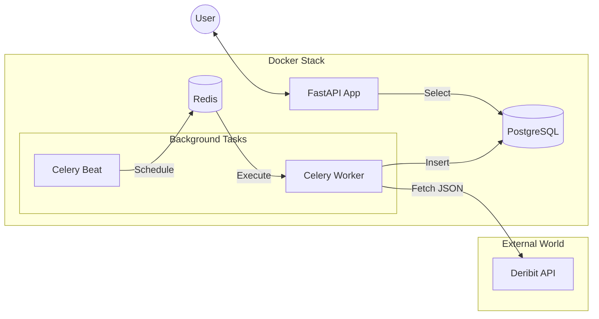

# Deribit Market Data Client


## Description:
An asynchronous Python-based client designed to automatically collect and serve market data (index prices) from the Deribit exchange.


## System Architecture


## Key Features:
- **Automated Data Collection**: Background tasks fetch `BTC_USD` and `ETH_USD` prices every minute.
- **RESTful API**: Fast and documented API built with FastAPI for accessing historical and real-time data.
- **Fully Asynchronous**: Powered by SQLAlchemy 2.0 and `asyncpg` for high-performance database operations.
- **Robust Testing**: Integration tests with 100% isolation using SQLite in-memory and comprehensive coverage reporting.

## Design Decisions
- **FastAPI & Asyncio**: An asynchronous stack was chosen to ensure high throughput, which is essential for services streaming financial data.
- **Celery & Redis**: Celery was selected for background tasks to decouple data fetching from the API. If the exchange responds slowly, it won't impact API performance for users.
- **Repository Pattern**: Data access is encapsulated in repositories. This simplifies maintenance, centralizes SQL logic, and makes database swapping for tests seamless.
- **Pydantic v2**: Used for strict data validation. We ensure data integrity at every stage—from the exchange's raw JSON to the final API response.
- **Docker-first Approach**: The entire project, including the test suite, is fully containerized to ensure consistent behavior across development and production environments.

## Quick Start:

### Prerequisites
- Docker и Docker Compose
- Git

### Deployment Instructions

1. #### Clone the Repository

```shell
  git clone https://github.com/Maksim-Gubenin/Deribit-client.git
  cd Deribit-client
```

2. #### Environment Configuration 

Create a `.env` file based on the template:

```shell
  cp .env.template .env
```
Modify the `.env` file if you need to adjust database credentials or polling intervals.

3. #### Launch the Application

```python
docker compose up --build
```

#### This command starts:
- **PostgreSQL**: Primary data storage.
- **Redis**: Message broker for Celery.
- **API**: Server accessible at http://localhost:8000.
- **Worker & Beat**: Background task processor and scheduler.

### Документация API
Interactive documentation is available once the app is running:

```python
http://127.0.0.1:8000/docs
```

### Available Endpoints


All requests require a ticker query parameter (e.g., `btc_usd`):

- GET `/api/v1/deribit/` — Retrieve all historical data for a ticker.
- GET `/api/v1/deribit/latest` — Get the most recent price.
- GET `/api/v1/deribit/filter` — Get data with date-based filtering.


## Testing
To run tests and check code coverage, use the dedicated compose file:

```python
docker compose -f docker-compose.test.yml up --build --abort-on-container-exit
```

Tests utilize an isolated SQLite in-memory database, ensuring high execution speed and data safety.

## Author
**Maksim Gubenin** 
- **Telegram**: @SKDM25: https://t.me/SKDM25
- **Email**: maksimgubenin@mail.ru
- **GitHub**: Maksim-Gubenin
