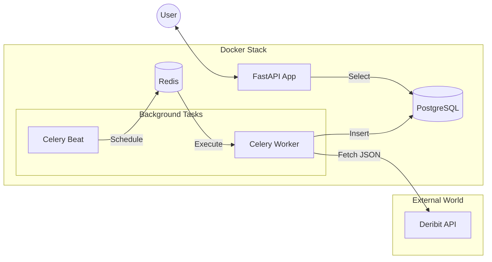

# Deribit Market Data Client


## Описание:
Асинхронный клиент на Python для автоматического сбора и предоставления рыночных данных (index price) с биржи Deribit.

## Демонстрация работы (Frontend Screenshot):


## Архитектура системы


## Основные возможности:
- **Автоматический сбор данных**: Фоновые задачи каждую минуту запрашивают цены BTC_USD и ETH_USD.
- **RESTful API**: Интерфейс на FastAPI для доступа к историческим и актуальным данным.
- **Полная асинхронность**: Использование SQLAlchemy 2.0 с драйвером asyncpg для эффективной работы с БД.
- **Надежное тестирование**: Интеграционные тесты с изоляцией через SQLite в памяти и отчетностью о покрытии.

## Проектные решения (Design Decisions)
- **FastAPI & Asyncio**: Выбран асинхронный стек для обеспечения высокой пропускной способности API, что критично для сервисов, транслирующих финансовые данные.
- **Celery & Redis**: Для фоновых задач выбран Celery. Это позволяет отделить логику получения данных от работы API: если биржа начнет отвечать медленно, это не замедлит работу пользователей приложения.
- **Repository Pattern**: Доступ к данным инкапсулирован в репозиториях. Это упрощает поддержку кода, позволяет легко менять SQL-запросы в одном месте и упрощает подмену БД в тестах.
- **Pydantic v2**: Используется для строгой валидации данных. Мы гарантируем корректность типов данных на всех этапах — от ответа API биржи до выдачи клиенту.
- **Docker-first**: Весь проект полностью контейнеризирован, включая тесты, что гарантирует идентичность работы приложения на машине разработчика и на сервере.

## Быстрый старт:

### Требования
- Docker и Docker Compose
- Git

### Инструкция по развертыванию

1. #### Клонируйте репозиторий

```shell
  git clone https://github.com/Maksim-Gubenin/Deribit-client.git
  cd Deribit-client
```

2. #### Настройка окружения 

Создайте файл `.env` на основе `env.template` и настройте на своё усмотрение. Для получения общих сведений о функционировании системы будет использован `.env.template`

```shell
  cp .env.template .env
```
При необходимости отредактируйте параметры подключения к БД или интервалы опроса в .env.

3. #### Запуск приложения

```python
docker compose up --build
```

#### Эта команда запустит:
- **PostgreSQL**: Хранилище данных.
- **Redis**: Брокер сообщений для Celery.
- **API**: Сервер доступен на http://localhost:8000.
- **Worker & Beat**: Обработка и планировщик фоновых задач

### Документация API
После запуска интерактивная документация доступна по адресам:

```python
http://127.0.0.1:8000/docs
```

### Доступные эндпоинты

Все запросы требуют query-параметр ticker (например, btc_usd):

- GET `/api/v1/deribit/` — Получить все данные по тикеру.
- GET `/api/v1/deribit/latest` — Получить последнюю актуальную цену.
- GET `/api/v1/deribit/filter` — Получить данные с фильтрацией по датам.


## Тестирование
Для запуска тестов и проверки покрытия (coverage) используйте специальный compose-файл:

```python
docker compose -f docker-compose.test.yml up --build --abort-on-container-exit
```

Тесты используют изолированную базу данных SQLite в памяти, что гарантирует безопасность данных и высокую скорость выполнения.

## Автор
**Максим Губенин** 
- **Telegram**: @SKDM25: https://t.me/SKDM25
- **Email**: maksimgubenin@mail.ru
- **GitHub**: Maksim-Gubenin
